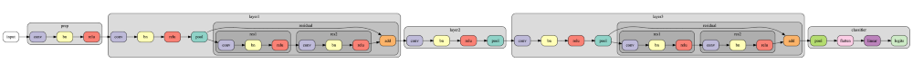
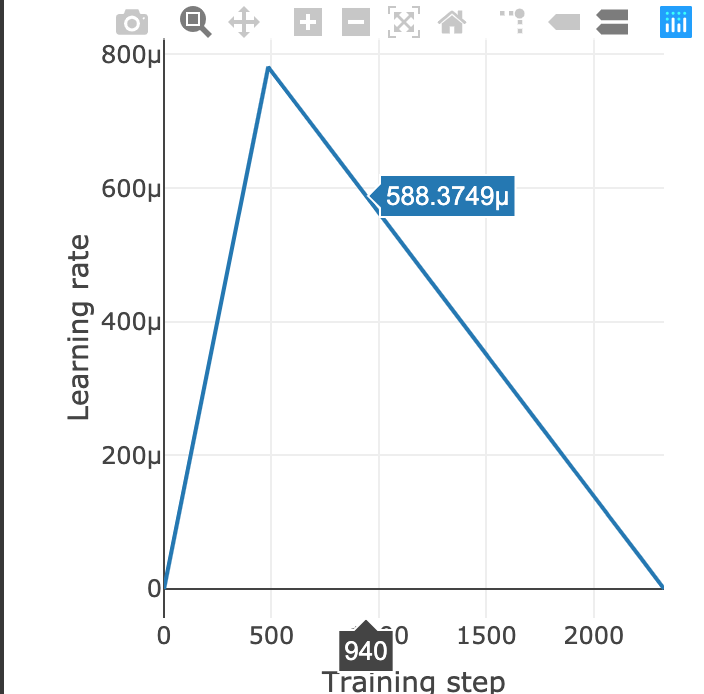

** Assignment 12 - 94% accuracy on Cifar10 in 2 minutes **
=================
Name : Nihar Kanungo Batch : 6:30 AM , Sunday

Executive Summary
------------------  
The Purpose of this article is to discuss briefly about how to train a Network with over 94% accuracy on the Cifar10 in 2 minutes. This Article is an extract/summary of the Post by David Yang(https://mc.ai/tutorial-2-94-accuracy-on-cifar10-in-2-minutes/). We will learn specifically how the fenwicks library helps in achieving the target.

We will see how On Colab’s TPUv2 (180 tflops), we can expect a comparable performance with “DavidNet” (Named  after its author David C. Page , winner of DAWNBench as of april 2019, who built a custom 9-layer Residual ConvNet, or ResNet) — within 2 minutes as the TPU takes a long time to initialize.

We will paste some codes from the Article here , but the intention here is to explain what the code is doing rather than replicating the code to demonstrate 94% accuracy in 2 minutes . We will try to run the network to replicate the concept if time permits, but first let's understand the code and more specifically the Fenwicks Library

Setting up. 
------------
First, we make necessary imports, download Fenwicks, and set up Google Cloud Storage (GCS).

import numpy as np
import tensorflow as tf
import os

Clone the Fenwicks Libray into the notebook 
--------------------------------------------

if tf.gfile.Exists('./fenwicks'):
  tf.gfile.DeleteRecursively('./fenwicks')
!git clone https://github.com/fenwickslab/fenwicks.git

Import Fenwicks to the Notebook
--------------------------------

import fenwicks as fw

Setup TPU in GCS to run this program
--------------------------------------

fw.colab_tpu.setup_gcs()

The above code calls the following function  which set up Google cloud storage for TPU . 
------------------------------------------------------------------------------------------

def setup_gcs(tpu_address: str = None):

    """
    Set up Google Cloud Storage for TPU.
    :param tpu_address: network address of the TPU, starting with 'grpc://'. Default: Colab's TPU address.
    :return: None
    """
    # Authenticate the user credentials 
    ----------------------------------------
    
    colab.auth.authenticate_user()

    tpu_address = tpu_address or TPU_ADDRESS

    # Open a Tensorflow session and read the contents of adc.json
    ---------------------------------------------------------------
    
    with tf.Session(tpu_address) as sess:
        with open('/content/adc.json', 'r') as f:
            auth_info = json.load(f)
        tf.contrib.cloud.configure_gcs(sess, credentials=auth_info)
        

Define some tunable hyperparameters 
-------------------------------------------------------------------------------------------

which are important for the training, using Colab’s nice interface of sliders and dropdown boxes.

The Hyper parameters are choosen as suggested by David Page in his research except the weight decay which is taken as 0.000125. The value chosen is more experimental than logical as under this setup taking 0.0005 gave a bad accuracy possibly due to underfitting. Also while David Page performed his research on GPU, this experiment was performed on TPU.

BATCH_SIZE = 512 #@param ["512", "256", "128"] {type:"raw"}
MOMENTUM = 0.9 #@param ["0.9", "0.95", "0.975"] {type:"raw"}
WEIGHT_DECAY = 0.000125 #@param ["0.000125", "0.00025", "0.0005"] {type:"raw"}
LEARNING_RATE = 0.4 #@param ["0.4", "0.2", "0.1"] {type:"raw"}
EPOCHS = 24 #@param {type:"slider", min:0, max:100, step:1}
WARMUP = 5 #@param {type:"slider", min:0, max:24, step:1}

As CIFAR10 is a bigger Dataset with RGB channels , so David Yang decided to store the dataset on GCS. Again one of the Fenwicks function helps in doing so .

data_dir - Data directory on GCS 

and 

work_dir - The directory for storing intermediate files generated during training

data_dir, work_dir = fw.io.get_gcs_dirs(BUCKET, PROJECT)

Here is how the function in fenwicks looks like 
-------------------------------------------------
def get_project_dirs(root_dir: str, project: str) -> Tuple[str, str]:

    """
    Get recommended directories for storing datasets (data_dir) and intermediate files generated during training
    (work_dir).
    :param root_dir: Root directory, which is often the Google Cloud Storage bucket when using TPUs.
    :param project: Name of the project.
    :return: Data directory for storaing datasets, and work directory for storing intermediate files.
    """
    
    data_dir: str = os.path.join(root_dir, 'data', project)
    work_dir: str = os.path.join(root_dir, 'work', project)
    gfile.makedirs(data_dir)
    gfile.makedirs(work_dir)
    return data_dir, work_dir

Looks like all the necessary preprocessing steps for training is performed by now . It's time to download the CIFAR10 dataset on which the network needs to run.

1. Download and store the Datasets in respective variables

2. Find out the Shape of the train and test datasets

3. Find out the Image size

4. FInd out the number of classes 

(X_train, y_train), (X_test, y_test) = tf.keras.datasets.cifar10.load_data()
n_train, n_test = X_train.shape[0], X_test.shape[0]
img_size = X_train.shape[1]
n_classes = y_train.max() + 1

Normalize the channels
-------------------------------

X_train_mean = np.mean(X_train, axis=(0,1,2))
X_train_std = np.std(X_train, axis=(0,1,2))
X_train = (X_train - X_train_mean) / X_train_std
X_test = (X_test - X_train_mean) / X_train_std

Fenwicks Function for using TFRecord which is based on Google’s ubiquitous ProtoBuf serialization library

train_fn = os.path.join(data_dir, "train.tfrec")
test_fn = os.path.join(data_dir, "test.tfrec")

fw.io.numpy_tfrecord(X_train, y_train, train_fn)
fw.io.numpy_tfrecord(X_test, y_test, test_fn)

Data augmentation and input pipeline
-------------------------------------
Fenwicks contains the following functions to perform 

1. padding - fw.transform.ramdom_pad_crop

2. randomly flip left and right - fw.transform.random_flip(x) - We can specify the image that needs to be flipped
 

3. Cutout augmentation as a regularization measure - fw.transform.cutout(x, 8, 8) - We can specify the number of pixels used for cutout

4. The Fenwicks image parser also parses the image based on the given size 

def parser_train(tfexample):
 x, y = fw.io.tfexample_numpy_image_parser(tfexample, img_size,
 img_size)
 x = fw.transform.ramdom_pad_crop(x, 4)
 x = fw.transform.random_flip(x)
 x = fw.transform.cutout(x, 8, 8)
return x, y

parser_test = lambda x: fw.io.tfexample_numpy_image_parser(x, img_size, img_size)

Build Input Pipeline using Fenwicks

train_input_func = lambda params: fw.io.tfrecord_ds(train_fn, parser_train, batch_size=params['batch_size'], training=True)

eval_input_func = lambda params: fw.io.tfrecord_ds(test_fn, parser_test, batch_size=params['batch_size'], training=False)

The Following lines of code build the convolutional network using the Fenwicks library.PyTorch’s default way to set the initial, random weights of layers does not have a counterpart in Tensorflow, however Fenwicks library got the feature to do so.

def build_nn(c=64, weight=0.125):
  model = fw.Sequential()
  model.add(fw.layers.ConvBN(c, **fw.layers.PYTORCH_CONV_PARAMS))
  model.add(fw.layers.ConvResBlk(c*2, res_convs=2,
  **fw.layers.PYTORCH_CONV_PARAMS))
  model.add(fw.layers.ConvBlk(c*4, **fw.layers.PYTORCH_CONV_PARAMS))
  model.add(fw.layers.ConvResBlk(c*8, res_convs=2,
  **fw.layers.PYTORCH_CONV_PARAMS))
  model.add(tf.keras.layers.GlobalMaxPool2D())
  model.add(fw.layers.Classifier(n_classes, 
  kernel_initializer=fw.layers.init_pytorch, weight=0.125))
return model

Here is the architecture of the model selected 

The final fully-connected classifier layer is following by a scaling operation, which multiplies the logits by 0.125. This scaling factor 0.125 is hand-tuned in DavidNet and is a hyper parameter.

Model training. DavidNet trains the model with Stochastic Gradient Descent with Nesterov momentum, with a slanted triangular learning rate schedule. Let’s build the learning rate schedule and plot it.

# Calculate the steps per epoch which depends on the Batch size selected 
steps_per_epoch = n_train // BATCH_SIZE 

# Find out the total steps 
total_steps = steps_per_epoch * EPOCHS

# Define the Loss Function and plot the curve 

lr_func = fw.train.triangular_lr(LEARNING_RATE/BATCH_SIZE, total_steps, warmup_steps=WARMUP*steps_per_epoch)
fw.plt.plot_lr_func(lr_func, total_steps)

# Build the SGD optimizer
opt_func = fw.train.sgd_optimizer(lr_func, mom=MOMENTUM,wd=WEIGHT_DECAY*BATCH_SIZE)
# model function for TPUEstimator
model_func = fw.tpuest.get_clf_model_func(build_nn, opt_func,
 reduction=tf.losses.Reduction.SUM)

Begin Training
-----------------

est = fw.tpuest.get_tpu_estimator(n_train, n_test, model_func, work_dir, trn_bs=BATCH_SIZE) 
est.train(train_input_func, steps=total_steps)

It was observed that after the slowish initialization and first epoch, each epoch takes around 2.5 seconds. Since there are 24 epochs in total, the total amount of time spent on training is roughly 1 Minute .
The Target seems to be achieved .

Let’s evaluate the model on the test set to see the accuracy:

result = est.evaluate(eval_input_func, steps=1)
print(f'Test results: accuracy={result["accuracy"] * 100: .2f}%, loss={result["loss"]: .2f}.')

It was observed that most of the time the Accuracy was above 94 % . The Importance of this exercise is the Fenwicks library which contains a lot of function which takes care many of the preprocessing steps and data conversion steps as well.

We should dig more into this library when we get time .

One interesting thing to remember is that the Fenwicks library also takes care of making the memory free after the exercise is complete . Let's see the lines of code below 

Finally, we delete all files in work_dir to save space on GCS. Optionally, we can clear up the data_dir as well.

fw.io.create_clean_dir(work_dir)
