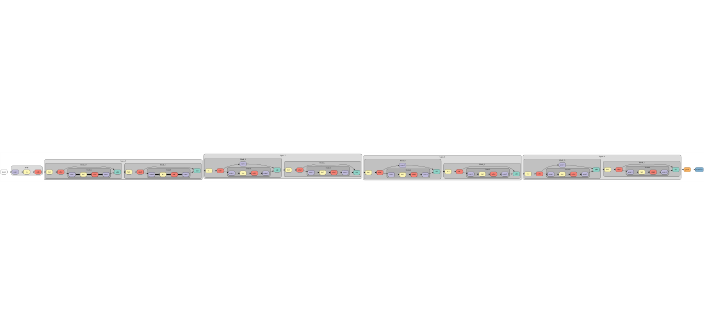
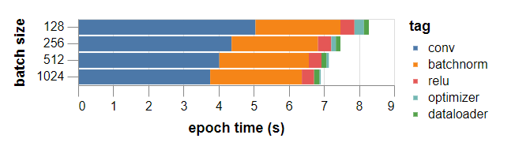
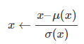
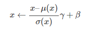
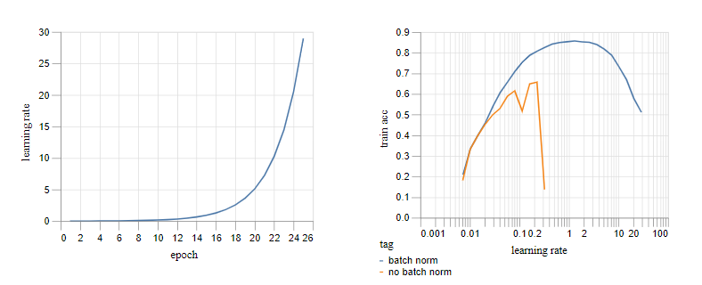
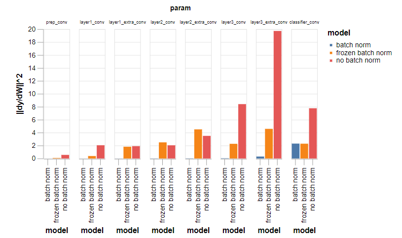
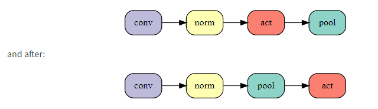
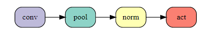
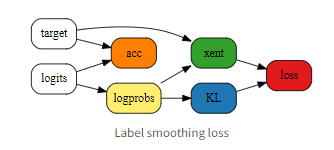

** Assignment 12**
=================
Name : Nihar Kanungo Batch : 6:30 AM , Monday

To Read https://mc.ai/tutorial-2-94-accuracy-on-cifar10-in-2-minutes/ (Links to an external site.) and https://myrtle.ai/how-to-train-your-resnet/ (Links to an external site.)

Write a report on both. Focus on the Fenwicks library defined in the first blog, and focus on all the steps take by David in 8 posts from the second link.

#Train a Resnet very fast with >94% Accuracy
------------------------------------------------

Executive Summary
------------------  
The Purpose of this article is to discuss briefly about how to train a Residual Network (Resnet) very fast with over 94% accuracy on the Cifar10. The article is prepared based on the understanding of all the research performed by DAVID PAGE, The Chief Scientist Who is a Professor of Biology in MIT. 

Training an Artificial Neural network from scratch is a challenging task especially when we are trying to achieve certain target. The reason behind so is to ensure that every aspect of the model training is been taken care and with the perfect proportion which would lead towards achieving the stated expectation.

The Purpose of this article is to describe the step by step approach/experiment performed by DAVID PAGE to achieve the target of training the Resnet model with 94% accuracy in 26 secs. 

The result was the outcome of a number of experiments performed again and again, here we will go through each one of them and see how the model emerged not only as the top rank in the DAWNBench but with a great margin.

Baseline Implementation
------------------------
We will start our discussion with  the fastest single GPU entry, from fast.ai student Ben Johnson who reached 94% accuracy in under 6 minutes (341s). The major differentiators were mixed-precision training, choosing a smaller network with sufficient capacity for the task and usage of higher learning rate to speed up SGD. 
The network used in the fastest submission was an 18-layer Residual network and a version of the network in PyTorch was used to replicate the learning rate schedule and hyperparameters from the DAWNBench submission as the base to start with.

Improvement Over Mini-Batches
What we know so far is that increasing that batch size may improve the accuracy of the network but at the same time it may be a memory hungry affair. So, what would be a best batch size to be considered in this scenario and how can it help improve the overall training time keeping the accuracy well beyond 94%?  Our training so far uses a batch size of 128. Larger batches should allow for more efficient computation so let’s see what happens if we increase batch size to 512?
Considerations
•	parameter updates are delayed until the end of a batch
•	weight decay after each batch and this should be increased by a factor of batch size to compensate for the reduction in the number of batches processed
•	If gradients are being averaged over mini-batches, then learning rates should be scaled to undo the effect and weight decay

with batch size 512. Training completes in 256s and with one minor adjustment to the learning rate – increasing it by 10% – we are able to match the training curve of the base runs with batch size 128 and 3/5 runs reach 94% test accuracy.

The fast training speed of the current setup comes in large part from the use of high learning rates. In the context of convex optimization (or just gradient descent on a quadratic), one achieves maximum training speed by setting learning rates at the point where second order effects start to balance first order ones and any benefits from increased first order steps are offset by curvature effects

Issues
-------

•	The delayed updates from mini-batching should incur the same curvature penalties as a corresponding increase in learning rate and training should become unstable. In short, if higher order effects can be neglected, you are not training fast enough

•	second order differences between small and large batch training could accumulate over time and lead to substantially different training trajectories

Claim
-------

•	First piece of evidence for our claim: increasing batch sizes does not immediately lead to training instability as it should if curvature was the issue, but not if the issue is forgetfulness which should be mostly unaffected by batch size

•	we run an experiment to separate out the effects of curvature, which depends primarily on learning rate, from forgetfulness, which depends jointly on learning rate and dataset size and found that if one wishes to train a neural network at high learning rates then there are two regimes to consider. For the current model and dataset, at batch size 128 we are safely in the regime where forgetfulness dominates and we should either focus on methods to reduce this or we should push batch sizes higher. At batch size 512 we enter the regime where curvature effects dominate and the focus should shift to mitigating these.

The Effect of Regularization on the Training Time
--------------------------------------------------

we can preload random training data onto the GPU to remove data loading and transfer times. We can also remove the optimizer step and the ReLU and batch norm layers to leave just the convolutions. If we do this, we get the following rough breakdown of timings across a range of batch sizes.

Let’s See all the different experiments performed one by one and see how it improves/degrades the training time by keeping the accuracy of 94% in mind. Please note the final outcome after all experiments was 94% accuracy with very less training time, it may happen that some of the experiments resulted in achieving one at the cost of loosing control over the other, but finally it achieved what it planned to.

#Experiment-1 
------------------------------------------------

Observation 
------------

1.	A large chunk of time is being spent on batch norm computations

2.	the main convolutional backbone (including pooling layers and pointwise additions) is taking significantly longer than the roughly one second predicted at 100% compute efficiency

3.	the optimizer and data loader steps don’t seem to be a major bottleneck and are not an immediate focus for optimization

Possible Issue
------------------

Problem with batch norms – the default method of converting a model to half precision in PyTorch (as of version 0.4) triggers a slow code path which doesn’t use the optimized CuDNN routine

Potential Solution
--------------------

If we convert batch norm weights back to single precision then the fast code is triggered and things look much healthier

Result
-------

With this improvement in place the time for a 35-epoch training run to 94% accuracy drops to 186s

#Experiment-2 
------------------------------------------------
Observation 
------------

Activation data is currently stored in NCHW format, whilst the fast CuDNN convolution routines for Tensor Cores expect data in NHWC order. As described here, the forward and backward computations perform transposes before and after each convolution, accounting for a significant proportion of the overall run time

Result
------

Cutting training to 30 epochs, would lead to a 161s finish, easily beating our current target, but simply accelerating the baseline learning rate schedule, leads to 0/5 training runs reaching 94% accuracy.

#Experiment-3 - Cutout
------------------------------------------------

Using random 8×8 square subsets of the training images, in addition to our standard data augmentation of padding, clipping and randomly flipping left-right.

Result
--------

Results on the baseline 35 epoch training schedule are promising with 5/5 runs reaching 94% accuracy and the median run reaching 94.3%, a small improvement over the baseline

#Experiment-4 – Manual Optimization 
------------------------------------------------

A bit of manual optimization of the learning rate schedule (pushing the peak learning rate earlier and replacing the decay phase with a simple linear decay since the final epochs of overfitting don’t seem to help with the extra regularization in place)

Result
--------

median run to 94.5%
If we accelerate the learning rate schedule to 30 epochs, 4/5 runs reach 94% with a median of 94.13%

#Experiment-5 – Higher Batchsize 
------------------------------------------------

We can push the batch size higher to 768 

Result
------

4/5 reach 94% with a median of 94.06%. The timings for 30 epoch runs are 161s at batch size 512 and 154s at batch size 768
These can also be considered 
we remain below 25% compute efficiency on a single GPU and there are known optimizations that could improve this. Secondly, it should be possible to reduce the number of training epochs using techniques such as Mixup regularisation and AdamW training

#Architecture 
------------------------------------------------

One of the ways to consider improvements is by modifying or considering an alternate Architecture to train. This would give an idea about how the different models behave under similar conditions and which one would be a best fit for further enhancements/improvements.

Modification -1 - Inclusion of Residual Block
-----------------------------------------------

Ease optimization by creating shortcuts through the network. The hope is that the shorter paths represent shallow sub-networks which are relatively easy to train, whilst longer paths add capacity and computational depth

Result 
------

Training the shortest path network for 20 epochs yields an unimpressive test accuracy of 55.9% in 36 seconds. Removing repeated batch norm-ReLU groups, reduces training time to 32s but leaves test accuracy approximately unchanged

Modification -2 – Working on Receptive field
---------------------------------------------

A serious shortcoming of this backbone network is that the down sampling convolutions have 1×1 kernels and a stride of two, so that rather than enlarging the receptive field they are simply discarding information. If we replace these with 3×3 convolutions.

Result
------

Things improve considerably and test accuracy after 20 epochs is 85.6% in a time of 36s.

Modification -3 – MaxPool Down Sample – Use conv of 3 x3 with stride of 1
---------------------------------------------------------------------------

We can further improve the down sampling stages by applying 3×3 convolutions of stride one followed by a pooling layer instead of using strided convolutions

Result
-------

We choose max pooling with a 2×2 window size leading to a final test accuracy of 89.7% after 43s. Using average pooling gives a similar result but takes slightly longer

Modification -4 – Global MaxPool
---------------------------------

We replace this with a more standard global max pooling layer and double the output dimension of the final convolution to compensate for the reduction in input dimension to the classifier

Result
------

final test accuracy of 90.7% in 47s

Modification -5 – Better BN Scale Unit
----------------------------------------

Change the initial batch norm scales are chosen uniformly at random from the interval [0,1]. A rough manual optimization of this extra hyperparameter suggest that 0.125 is a reasonable value

Result
--------

20 epoch training reaches a test accuracy of 91.1% in 47s

One approach that doesn’t seem promising is just to add width to the 5-layer network. If we double the channel dimensions and train for 60 epochs, we can reach 93.5% test accuracy but training takes all of 321s.
----------------------------------------------------------------------------------------------------------------------------------

We shall consider two classes of networks.

•	The first is constructed by optionally adding a convolutional layer (with batch norm-ReLU) after each max pooling layer. 

•	The second class is constructed by optionally adding a residual block consisting of two serial 3×3 convolutions with an identity shortcut, after the same max pooling layers.

•	We insert an additional 2×2 max pooling layer after the final convolutional block and before the global max pooling so that there are 3 locations to add new layers

Execution
----------

We train each of the 15 networks (improved backbone + 7 variations in each class) for 20 epochs and also for 22 epochs to understand the benefit of training for longer versus using a deeper architecture. If we ran each experiment once, this would correspond to a full 30 minutes of computation. Unfortunately, the standard deviation of each final test accuracy is around 0.15%, so to have any hope of drawing accurate conclusions, we run each experiment 10 times, leading to ~0.05% standard deviations for each of the data points. Even so, the variation between architectures in rate of improvement going from 20 to 22 epochs is probably mostly noise.

Result
--------

The rate of improvement from training for longer seems slow compared to the improvements achievable by using deeper architectures. Of the architectures tested, perhaps the most promising is Residual: L1+L3 which we fortuitously chose to illustrate above. This network achieves 93.8% test accuracy in 66s for a 20-epoch run. If we extend training to 24 epochs, 7 out of 10 runs reach 94% with a mean accuracy of 94.08% and training time of 79s!

#Impact of Hyper Parameters
------------------------------------------------

It’s time to address this issue and ask what our hyperparameter neglect has cost.

•	Have we missed an opportunity for optimization or worse, reached invalid conclusions? 

•	Or alternatively, has the importance and difficulty of hyperparameter tuning been overstated?

To optimize these hyperparameters we will follow a type of cyclical coordinate descent in which we tune one parameter at a time with a very crude line search (doubling or halving and retraining until things get worse)

 
One might believe that optimizing further at a higher parameter resolution – and using multiple training runs to reduce noise – would lead to improvements over our baseline training. We have not succeeded in doing so. Two of the directions in hyperparameter space are extremely flat at this point and the other is close enough to optimal to be almost flat also. In conclusion, there is a large and readily identifiable region of hyperparameter space whose performance is hard to distinguish at the level of statistical noise.

Outcome
--------

•	Curvature effects are sub-dominant in the current training regime since learning rates are limited by other effects 

•	the weight decay step is just a rescaling of w and thus a no-op from the point of view of the loss function

•	The large scale on the weights is equivalent to a very small learning rate as far as the gradient update step is concerned. The weight decay step proceeds as normal and gradually shrinks the weights. Once the weights reach a small enough scale, the gradient updates start to be important and balance the shrinking effect of the weight decay. If the weights start too small, the opposite dynamics take place and the gradient updates dominate the weight decay term in importance until the scale of weights returns to equilibrium.

•	Weight decay in the presence of batch normalization acts as a stable control mechanism on the effective step size. If gradient updates get too small, weight decay shrinks the weights and boosts gradient step sizes until equilibrium is restored. The reverse happens when gradient updates grow too large

So, to conclude 
----------------

 a number of nearly flat directions in hyperparameter space. This greatly simplifies the search problem. Optimizing along these directions helps a little, but the penalty for doing so badly, is small. In the following post, we will argue that, in favorable circumstances, whole families of architectures share similar values of optimal parameters.
 
#Weight Decay
------------------------------------------------

Our main task for today will be to shore up the two first order arguments with a more careful study of the weight norm dynamics. In the process we will find a close relation with the technique of Layer-wise Adaptive Rate Scaling which has been introduced recently in the context of large batch training on ImageNet. We study the implications of this relation and propose that it may be behind a remarkable stability in the optimal learning rate across different architectures. Let’s look in more detail at the dynamics of weight norms in the presence of weight decay.

gradient updates lead to an increase in weight norm whilst weight decay leads to a decrease. For small weights, the growth term dominates and vice versa for large weights.

After performing various experiments, one might think that layers with different sizes, initializations and positions in the network might require different learning rates and that the optimal learning rate might then vary significantly between architectures because of their different layer compositions.

A possible explanation is that the LARS-like dynamics of SGD with weight decay, provides a useful type of adaptive scaling for the different layers so that each receive the same step size in scale invariant units and that this renders manual tuning of learning rates per layer unnecessary. One might probe this experimentally by manually optimizing learning rates separately for each layer and seeing to what extent optimum values coincide.

#Batch Normalization
------------------------------------------------

Batch Normalization since it’s inception in the year 2015 has been very popular in training the Deep networks. Let’s see how this helped in reducing the training time. Today, we’re going to explore the detailed mechanism by which batch norm enables the high learning rates crucial for rapid training. Let’s start with a high-level view.

Batch norm works by reparameterising the function space such that these constraints are easier to enforce, curvature of the loss landscape is diminished and training can proceed at a high rate.

What is Batch Norm?

Batch norm acts by removing the mean and normalizing the standard deviation of a channel of activations

Statistics μ(x),σ(x) are computed over pixels in an image and examples in a batch. They are frozen at test time.A learnable output mean  β and standard deviation γ are usually applied, potentially undoing everything:

This is not as silly as it might seem! Reparametrizing the network can radically change the optimization landscape

The Good
-----------

Empirically batch norm has been extremely successful especially for training conv nets. Many proposed alternatives have failed to replace it.

•	it stabilizes optimization allowing much higher learning rates and faster training

•	it injects noise (through the batch statistics) improving generalization

•	it reduces sensitivity to weight initialization

•	it interacts with weight decay to control the learning rate dynamics

It can be seen that the network with batch norm is stable over a much larger range of learning rates (note the log scale on the x-axis in the second plot.) The ability to use high learning rates allows training to proceed much more rapidly for the model with batch norm.

The Bad
----------

So why has so much effort been devoted to finding replacements? Batch norm has several drawbacks:

it’s slow (although node fusion can help)

it’s different at training and test time and therefore fragile

it’s ineffective for small batches and various layer types

it has multiple interacting effects which are hard to separate

Deep nets and constant functions
---------------------------------

The aim of this section is to understand the typical behavior of deep networks at initialization. We shall see hints of the problems to come when we start training. In particular care needs to be taken at initialization if the network is to avoid computing a constant function, independent of the inputs. We shall review the surprising and under-appreciated fact that the standard He-et-al initialization produces effectively constant functions for sufficiently deep ReLU networks.

It's observed that Networks without Batch Normalization get a bit wobbly by layer 50. Now if we see all the channels independently then by layer 50 each channel effectively choses a constant value to take, independent of the input. If we remove the ReLUs and rescale the weights appropriately so that we have a purely linear network, the problem goes away.

Fixing the RELU network at the initiation the order was restored and the network no longer compute a constant function 

When executing a real network of 8 layers with out Batch norm it was observed that it collapses to a constant function more rapidly , this is partly due to the inclusion of max-pooling layers which also acts to increase channel-wise mean.

In the absence of batch norm, the standard initialisation scheme for deep networks leads to ‘bad’ configurations in which the network effectively computes a constant function. By design, batch norm goes a long way towards fixing this. As far as initialisation is concerned – ‘frozen batch norm’, based on activation statistics at initialisation – works just as well.

In the absence of batch norm, there are bad configurations in a small neighbourhood of the good configurations traversed during a training run. The proximity of these bad configurations – with high training loss – indicates the existence of highly curved directions in the loss landscape and places a limit on the achievable learning rates.

Experimental Settings
------------------------

•	First we describe three partially trained networks to compare: one with batch norm, one without and the third trained with batch norm which is subsequently frozen.

•	We show that for the two networks without active batch norm, one can use backprop to find nearby parameter configurations which produce constant outputs and thus achieve a high training loss

•	We review the relation between curvature of the training loss – in the form of eigenvalues of the Hessian – and instabilities of SGD

•	We then compute the leading eigenvalues and eigenvectors of the Hessian for our three networks. We find that the networks without batch norm have a small number of outlying eigenvalues which greatly limit the achievable learning rates. We show how the corresponding eigenvectors are related to the nearby ‘bad’ parameter configurations that we found

Outcomes
-------------

The maximal learning rate will have to be tailored to the network since the one without batch norm is unstable at higher learning rates
We shall find that the two networks without active batch norm layers behave similarly to one another and entirely differently from the batch norm network

the gradient is concentrated in the final layer for the ‘batch norm’ network, but distributed throughout layers for the other two. We can understand this as follows internal covariate shift is able to propagate to external shift at the output layer.

For the ‘batch norm’ network, changes to the mean and variance at earlier layers get removed by subsequent batch normalisation and so there is little opportunity for early layers to affect the output distribution.

If we apply batch normalisation after the ReLU layers and then freeze after partial training, we might expect a different story in which the effect of weight perturbations in early layers is greatly diminished. (This is analagous to the situation at initialisation where we applied an analytic shift and rescaling after ReLU layers in the simple, fully connected net and found that the problem with propagating means and constant outputs disappeared.)

For the ‘batch norm’ model , the means of different channels are somewhat affected but the effects are rather mild as expected.

For the ‘frozen batch norm’ model, a clear picture emerges in which the means of typically a small number of channels are affected

For the ‘no batch norm’ model, the 10 eigenvectors seem to correspond to a mixture of mean perturbations and rescalings of the different channels

the leading instability of SGD is caused simply by a failure to control the means of the outputs

We see that even if we fixed the instability from the first three moments of the output, the two models without active batch norm would remain substantially less stable than the batch norm model.

•	First we reviewed the result that, in the absence of batch norm, deep networks with standard initialisations tend to produce ‘bad’, almost constant output distributions in which the inputs are ignored. We discussed how batch norm prevents this and that this can also be fixed at initialisation by using ‘frozen’ batch norm.

•	Next we turned to training and showed that ‘bad’ configurations exist near to the parameter configurations traversed during a typical training run. We explicitly found such nearby configurations by computing gradients of the means of the per channel output distributions. Later we extended this by computing gradients of the variance and skew of the per channel output distributions, arguing that changing these higher order statistics would also lead to a large increase in loss. We explained how batch norm, by preventing the propagation of changes to the statistics of internal layer distributions, greatly reduces the gradients in these directions.

•	Finally, we investigated the leading eigenvalues and eigenvectors of the Hessian of the loss, which account for the instability of SGD, and showed that the leading eigenvectors lie primarily in the low dimensional subspaces of gradients of output statistics that we computed before. The interpretation of this fact is that the cause of instability is indeed the highly curved loss landscape that is produced by failing to enforce appropriate constraints on the moments of the output distribution.

•	Taking a step back, the main lesson is that deep nets provide a convenient parameterisation of a large class of functions, capable of expressing many computations of interest, but that within this parameterisation there are certain constraints that need to be observed to produce useful functions – rather than say constants. During training, it is necessary to maintain these constraints and this places a heavy burden on a first-order optimiser such as SGD, whose learning rate is limited by the steep curvature in the directions orthogonal to the ‘good’ subspace.

•	A possible solution would be to use a second-order optimiser to handle the problematic curvature. (Indeed, our results cast some light on the success of second-order methods using the so-called ‘generalised Gauss-Newton’ approximation to the Hessian, since the outlying eigenvalues that we identify originate within this term.) However, the results above might convince one that a method such as batch normalisation – which directly tackles the issue underlying the problematic curvature by improving the parameterisation of function space – coupled with a first-order optimiser, is going to be hard to beat.

•	Despite our focus on the distributions of channels in the output layer, it is not sufficient to fix these. If it were, we could place a single batch norm layer towards the end of the network and this could be expected to work as well as batch norms distributed throughout. The final plot above – which shows the scale of residual instabilities after fixing the leading moments of the output distributions – indicates that doing so is unlikely to approach the stability of the network with batch norm layers throughout.

•	A reasonable expectation is that the internal layer distributions are also important in order to maintain the expressivity of the function computed by the network. For example, if at some intermediate layer, a small number of channels become dominant, this would introduce a bottleneck, greatly reducing the set of functions that the network is capable of representing. We would expect that directly tackling this kind of internal distributional shift is a further role of batch norm and this is an interesting direction for future research.

•	Another lesson is that batch norm seems almost ideally designed to tackle the key optimisation issue, which is indeed one of propagation of changes to channel-wise distributions. It would be very interesting to investigate the various alternatives to batch norm that have been proposed and understand if and how they manage to achieve a similar thing. These insights should also provide guidance in developing new stabilization mechanisms, potentially providing a sharper toolkit than the alternative run-it-and-see approach.

#Multiple Tricks to achieve the Training Speed
------------------------------------------------

Preprocessing on the GPU (70s)
----------------------------------

•	Three seconds wasted on data preprocessing, which counts towards training time. Recall that we are normalising, transposing and padding the dataset before training to avoid repeating the work at each epoch

•	We can do better by transferring the data to the GPU, preprocessing there and then transferring back to the CPU for random data augmentation and batching

•	We can avoid this by applying the same augmentation to groups of examples and we can preserve randomness by shuffling the data beforehand.

•	we can consider capping it at a reasonable limit – say 200 randomly selected groups per epoch.
After doing all these If we rerun the network and training from our DAWNBench submission with the new GPU data processing, training time drops just under 70s, moving us up two places on the leaderboard!

Aside: mixed precision training
----------------------------------

In our original DAWNBench submission and in the code for the test above, we simply converted the model to float16 without all the niceties of so-called mixed precision training, although we include a basic sort of ‘loss scaling’ by summing rather than averaging losses in a batch. It is straightforward to implement proper mixed precision training but this adds about a second to overall training time and we found it to have no effect on final accuracy, so we continue to do without it below.

Moving max-pool layers (64s)
-------------------------------

Switching the order leads to a further 3s reduction in 24 epoch training time with no change at all to the function that the network is computing! 

The result is a small negative effect on test accuracy which moves to 94.0% (mean of 50 runs) compared to our baseline of 94.1%. More positively, this achieves a substantial 5s reduction in training time. The 5s gain from a more efficient network more than compensates the 2.5s loss from the extra training epoch. The net effect brings our time to 64s, up to third place on the leaderboard

Label smoothing (59s)
-------------------------

It involves blending the one-hot target probabilities with a uniform distribution over class labels inside the cross entropy loss.

Accuracy for 23 epochs of training is 94.1% and training time dips under a minute!

CELU activations (52s)
--------------------------

We are otherwise happy with ReLU so we’re going to pick a simple smoothed-out alternative. Our choice is the Continuously Differentiable Exponential Linear Unit or CELU activation since it is smooth (unlike ELU)
We roughly hand-tune the smoothing parameter αα to a value of 0.075 – note that this is much lower than the default value of 1. This gives an impressive improvement to 94.3% test accuracy (mean of 50 runs) allowing a further 3 epoch reduction in training and a 20 epoch time of 52s for 94.1% accuracy.

Ghost batch norm (46s)
-----------------------

Our batches are of size 512 and we can’t afford to reduce them without taking a serious hit on training times, but we can apply batch norm separately to subsets of a training batch. This technique, known as ‘ghost’ batch norm, is usually used in a distributed setting but is just as useful when using large batches on a single node
This gives a healthy boost to the 20 epoch test accuracy of 94.2%. As training becomes ever shorter, it is occasionally helpful to increase the learning rate to compensate. If we raise the max learning rate by 50% we can achieve 94.1% accuracy in 18 epochs and a training time of 46s.

Frozen batch norm scales (43s)
----------------------------------

Actually we can fix the batch norm scales to 1 instead if we rescale the αα parameter of CELU by a compensating factor of 4 and the learning rate and weight decay for the batch norm biases by 4**2 and 1/4**2 respectively. We prefer to do things this way since it makes the impact of the channel scales on the learning rate dynamics of the biases more explicit.
18 epoch test accuracy improves to 94.2%.
Finally we can use the increased accuracy to reduce training to 17 epochs. The new test accuracy is 94.1% and most importantly we’ve overtaken the 8 GPUs of BaiduNet9P with a time of 43s, placing us second on the leaderboard!

Input patch whitening (36s)
-------------------------------

Batch norm does a good job at controlling distributions of individual channels but doesn’t tackle covariance between channels and pixels. Controlling the covariance at internal layers, using a ‘whitening’ version of batch norm, might be helpful but would entail extra computation as well as non-trivial implementation effort. We are going to focus on the easier problem at the input layer.
 let’s replace the first 3×3 convolution of the network with a fixed 3×3 whitening convolution to equalise the scales of the eigenpatches above, followed by a learnable 1×1 convolution and see the effect on training.
17 epoch test accuracy jumps to 94.4% allowing a further 2 epoch reduction in training time. 15 epochs brings a test accuracy of 94.1% in 39s, closing in on the 4-GPU, test-time-augmentation assisted DAWNBench leader! If we increase the maximum learning rate by a further ~50% and reduce the amount of cutout augmentation, from 8×8 to 5×5 patches, to compensate for the extra regularisation that the higher learning rate brings, we can remove a further epoch and reach 94.1% test accuracy in 36s, moving us narrowly into top spot on the leaderboard!!

Exponential moving averages (34s)
------------------------------------

learning rates need to be annealed towards the end of training to enable optimisation along the steeper and noisier directions in parameter space. Parameter averaging methods allow training to continue at a higher rate whilst potentially approaching minima along noisy or oscillatory directions by averaging over multiple iterates.
For efficiency reasons we update the moving average every 5 batches since we find that more frequent updates don’t improve things. We need to choose a new learning rate schedule with higher learning rates towards the end of training, and a momentum for the moving average.
Test accuracy improves to 94.3% allowing us to trim a further epoch. 13 epoch training reaches a test accuracy of 94.1%, achieving a training time below 34s and a 10× improvement over the single-GPU state-of-the-art at the outset of the series!

Test-time augmentation (26s)
---------------------------------

present both the input image and its horizontally flipped version and come to a consensus by averaging network outputs for the two versions, thus guaranteeing invariance. This eminently sensible approach goes by the name of test-time augmentation
we have just introduced a larger network for which we have an efficient stochastic training methodology. On the other hand, if we don’t limit the amount of work that we are prepared to do at test time then there are some obvious degenerate solutions in which training takes as little time as is required to store the dataset!
With our current network and 13 epoch training setup, the test accuracy with TTA rises to 94.6%, making this the largest individual effect we’ve studied today.
If we remove the remaining cutout data augmentation – which is getting in the way on such a short training schedule – we can reduce training to 10 epochs (!) and achieve a TTA test accuracy of 94.1% in 26s! 

#Summary
------------------------------------------------

This article is a step by step note on how David Page achieved 94% accuracy in 26seconds . For more details on the topics the reader is requested to visit the following link and read all the 8 articles .

https://myrtle.ai/how-to-train-your-resnet-/
