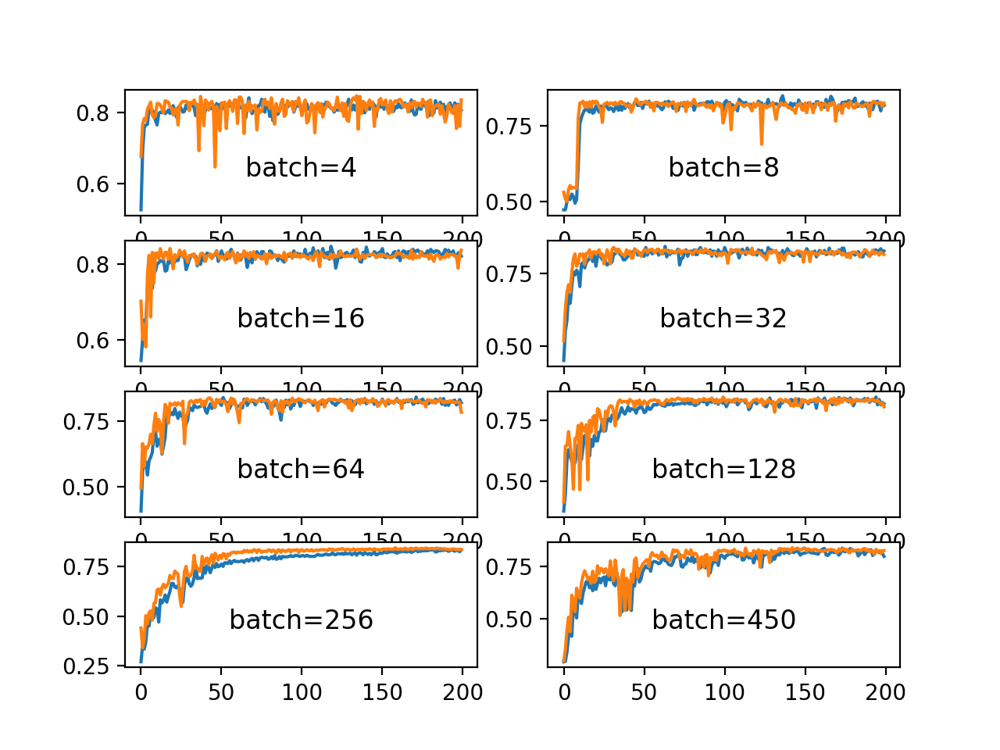

Assignment 3
===================
Name : Nihar Kanungo Batch : 6:30 AM , Monday

Attn!!!! theschoolofai admin :
===========================

The Assignment3_99.23_Accuracy.ipynb is the latest one with proper comments . The earlier ones with 99.12% accuracy and 99.19% accuracy is included to show the improvements achieved . Those doesn't include comments and can be referred if the reader wants to see the earlier runs for comparision. Having said that there are images pasted to this readme file which shows the difference between the three networks.

Background :
===========

This is a simple Image Recognition program which makes use of the MNIST preprocessed dataset to process the handwritten digit images and predict the numerical digit each image resents . The Code uses one of the most popular Tensorflow API Keras to perform the operations .It's a supervised Computer Vision problem.

Input
===========
1) 60000 Handwritten digit images (between 0-9) 

2) The Images are already segreegated as Train and Test Data with the respective target values

Environment
===========
Development - Colab GPU , Jupyter Notebook

Repository : Github

Algorithm
===========
Linear Model 

Convolutional Neural Network (2D) - Gray Scale images

Maxpooling 

Softmax Activation function

loss Function : Categorical Crossentropy

Optimizer=Adam

Metrics=accuracy

Parameters
===========
Batch Size - Variable 

Epochs - Variable

Kernel Size - Variable (Advisable to use 3 * 3)

Number of Kernels - Variable 

Condition
===========
The Number of parameters < 20,000

Should use only Conv2D

Should not have applied Maxpooling before 2-4 layers of the conversion into number of classes (10 in this case)

Maxpooling should be applied on receptive field of at least 5 x 5 or 7 x 7

Activation function should be relu on conv 2D

Expected Result
===========
To get >= 99.4 % accuracy

Description
=============
Below is just a pictorial representation of how convolution reduces the image size by increasing the receptive field. 
The Illustration shows an image of 9 x 9 at the beginning where as in reality the images are very big and complex in nature. We will see in future how to apply different techniques on then, but for simplicity of our understanding we will use small size kernels here. If you haven’t seen the previous article which talks about why a 3 x 3 kernel is the best one to use then please go back and read through it. 

We can also see how varying batch size affects the performance of the network. We have used a different batch size in our 3rd example which gave us an accuracy of 99.23 %

Looks like the higher batch size may help to generalize well. Let's figure it out if that's the case

Actual Result
===========
Best Results till now ( 2nd August 5:50 PM)

Accuracy - 99.23 %

Accuracy - 99.21 %

Accuracy - 99.20 %

Accuracy - 99.19 %

Accuracy - 99.17 %

We have included 3 programs here for demonstration and here are the highlights of those

Summary
-----------
EVen after trying for multiple times we are unable to achieve the magic number 99.4 % test accuracy . What could be the reason ?

1. Less number of epochs ?
2. Smaller Batch size ?
3. Less number of parameters ?
4. The Optimizer ? 
or something else ???

Let's drill down more onto each of the factors and see of we achieve the magic number . So stay tuned for my next post to see if we can fix the issue and achieve our target

*******************  Prepared by : Nihar Kanungo*******************************

